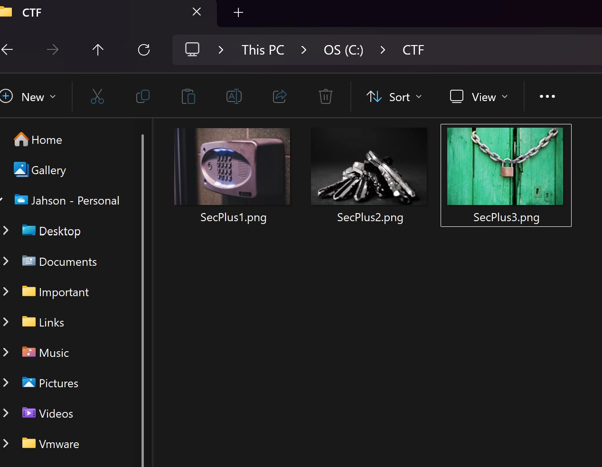
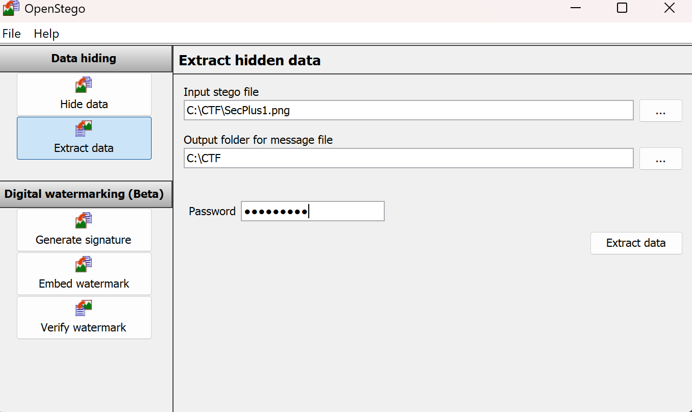
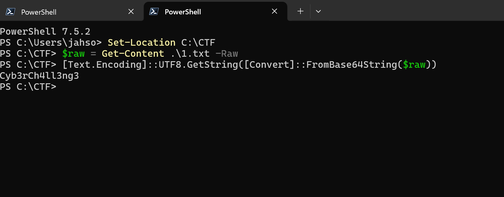
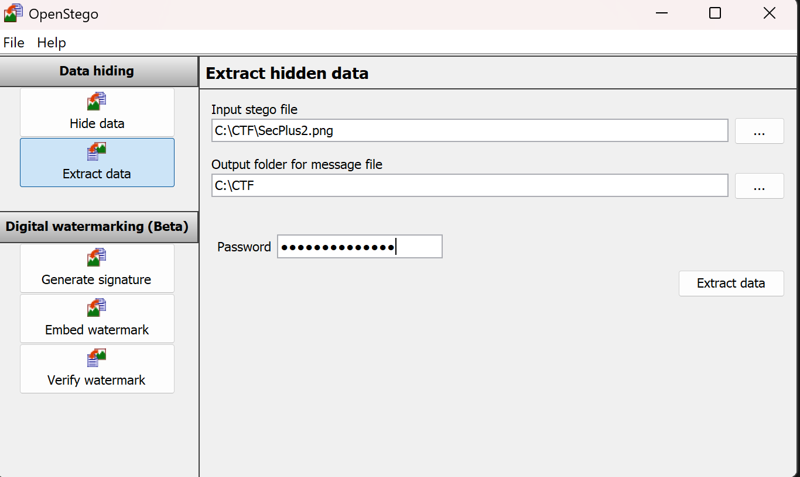
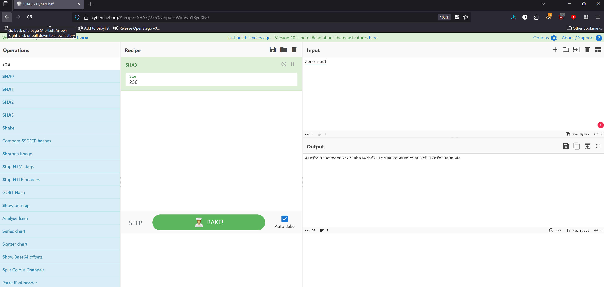
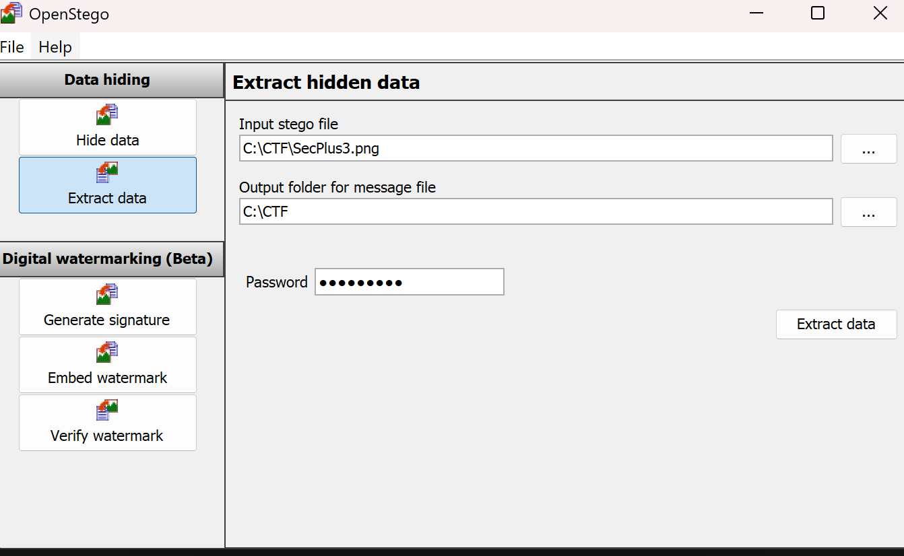
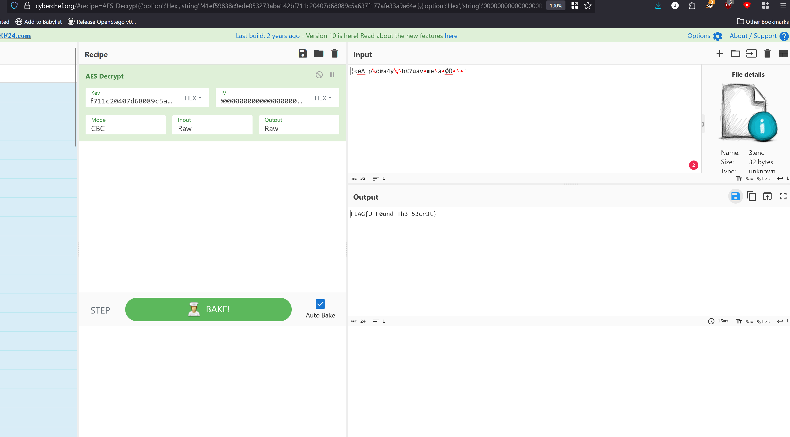
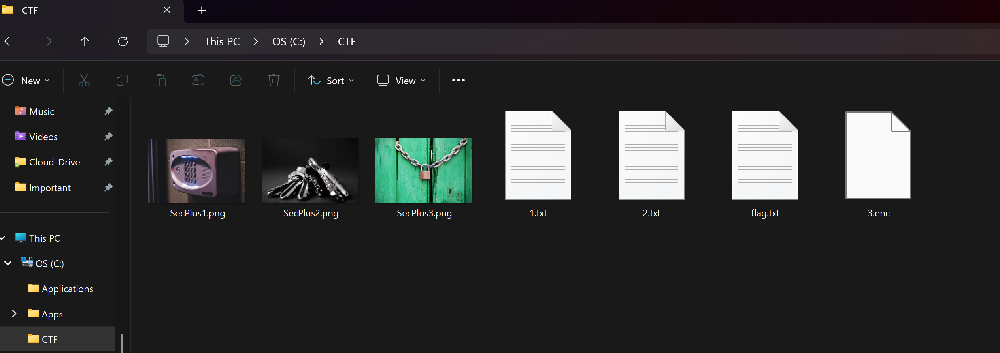

[](LICENSE)


```markdown
# Blockchain CTF — Windows-Only (Stego → Base64 → SHA-3-256 → AES-256-CBC)

A three-block cryptography challenge designed for a Windows workflow. Start with `SecPlus1.png`, follow the clues across steganography, Base64 decoding, SHA-3-256 hashing, and AES-256-CBC decryption, and recover the final flag:

```

FLAG{U\_F0und\_Th3\_53cr3t}

````

---

## Table of Contents

1. [Overview](#overview)  
2. [Repo Contents](#repo-contents)  
3. [Prerequisites (Windows Only)](#prerequisites-windows-only)  
4. [How to Solve (Step-by-Step)](#how-to-solve-step-by-step)  
   - [Block 1 — Stego → Base64](#block-1--stego--base64)  
   - [Block 2 — Stego → SHA-3-256 key](#block-2--stego--sha-3-256-key)  
   - [Block 3 — Stego → AES-256-CBC](#block-3--stego--aes-256-cbc)  
5. [Integrity & Reproducibility (SHA-256)](#integrity--reproducibility-sha-256)  
6. [Troubleshooting](#troubleshooting)  
7. [(Optional) How This Was Built](#optional-how-this-was-built)  
8. [Suggested Screenshot Map](#suggested-screenshot-map)  
9. [License](#license)  
10. [Credits](#credits)

---

## Overview

Each block reveals the key material needed to unlock the next:

- **Block 1**: Extract a hidden file via steganography and **Base64-decode** it to get the next passphrase.  
- **Block 2**: Extract instructions that direct you to compute **SHA-3-256** of a phrase and use its **hex digest** as the AES key.  
- **Block 3**: Extract an encrypted file and **AES-decrypt** it (CBC, PKCS7) using the derived key and a zero IV to reveal the final flag.

Designed for clarity and reproducibility in a Windows environment using OpenStego, CyberChef, and PowerShell.

---

## Repo Contents

- `SecPlus1.png` — Block 1 stego image (Stego → Base64)  
- `SecPlus2.png` — Block 2 stego image (Stego → hashing instruction)  
- `SecPlus3.png` — Block 3 stego image (Stego → AES ciphertext)  
- `README.md` — this document  
- `image_hashes_sha256.txt` — (optional) SHA-256 hashes of the three images  
- `report-assets/` — (optional) screenshots used in the write-up

**GitHub repo:** https://github.com/jahsonjb/blockchain-ctf-windows

---

## Prerequisites (Windows Only)

- **OpenStego** (GUI) — for **Data Extraction**  
- **CyberChef** (desktop or web) — for **SHA-3-256 hashing** and **AES-256-CBC** encryption/decryption  
  > Windows `CertUtil` does **not** support SHA-3; use CyberChef for SHA-3-256.  
- **PowerShell** — built in to Windows (for simple decoding and hashing checks)

---

## How to Solve (Step-by-Step)

Assume files are together (e.g., `C:\CTF`) and you have read/write permissions.

### Block 1 — Stego → Base64

1. **Extract the hidden file (OpenStego → Data Extraction)**  
   - **Stego File:** `SecPlus1.png`  
   - **Password:** `StartHere`  
   - **Output Folder:** your working directory (e.g., `C:\CTF`)  
   - Click **Extract Data** → you should get `1.txt`.

2. **Base64-decode the output (PowerShell)**

   ```powershell
   Set-Location C:\CTF
   $raw = Get-Content .\1.txt -Raw
   [Text.Encoding]::UTF8.GetString([Convert]::FromBase64String($raw))
````

**Expected result:**

```
Cyb3rCh4ll3ng3
```

Use this value as the Block-2 passphrase.

---

### Block 2 — Stego → SHA-3-256 key

1. **Extract the hashing instruction (OpenStego → Data Extraction)**

   * **Stego File:** `SecPlus2.png`
   * **Password:** `Cyb3rCh4ll3ng3`
   * **Output Folder:** your working directory
   * Click **Extract Data** → you should get `2.txt` with instructions.

2. **Derive the AES key (CyberChef)**

   * Clear any prior recipe.
   * Add operation **`SHA3-256`** (ensure it’s **SHA-3**, not Keccak).
   * In the input pane, type exactly:

     ```
     ZeroTrust
     ```
   * Copy the **hex digest** from the output.

   **Expected digest:**

   ```
   41ef59838c9ede053273aba142bf711c20407d68089c5a637f177afe33a9a64e
   ```

   This 64-hex-char digest is **32 bytes = 256 bits**, which will be your **AES-256** key.

---

### Block 3 — Stego → AES-256-CBC

1. **Extract the ciphertext (OpenStego → Data Extraction)**

   * **Stego File:** `SecPlus3.png`
   * **Password:** `ZeroTrust`
   * **Output Folder:** your working directory
   * Click **Extract Data** → you should get an encrypted file (e.g., `3.enc`).

2. **AES-decrypt in CyberChef**

   * Clear any prior recipe, then add **AES Decrypt**.
   * Set:

     * **Mode:** `CBC`
     * **Key:** set **format = Hex**, paste the SHA-3-256 digest from Block 2
     * **IV:** set **format = Hex**, value `00000000000000000000000000000000` (16 bytes of zeros = 32 hex zeros)
     * **Padding:** `PKCS7` (default)
   * Load the encrypted file (e.g., `3.enc`) into the **input** pane.
   * The **output** pane should display the plaintext flag:

   ```
   FLAG{U_F0und_Th3_53cr3t}
   ```

---

## Integrity & Reproducibility (SHA-256)

Verify you’re using the exact same images by checking **SHA-256**.

**PowerShell (run in the folder with your images):**

```powershell
Get-FileHash .\SecPlus1.png -Algorithm SHA256
Get-FileHash .\SecPlus2.png -Algorithm SHA256
Get-FileHash .\SecPlus3.png -Algorithm SHA256
```

**Published results (replace with your actual values if different):**

* `SecPlus1.png`: **CAF64F3E39FA5A9E211522CD9E5CA644F84BDF2BD4EA21418493B7A25D7DA37F**
* `SecPlus2.png`: **2A0FC6F26C2F162ED561324CA90EC1BD2555E752BD7C812DA3A7196672305257**
* `SecPlus3.png`: **F461FEC9E7234CA5331562803FC578237E2A6DA75A5E8FDBECE4C6B22045E35C**

> If a hash does not match, the file is not identical.

---

## Troubleshooting

* **Extraction fails in OpenStego**

  * Confirm you’re using the **stego PNG** (not the original cover).
  * Verify the **passphrase** for that block.
  * Ensure you have write permissions to the output folder.

* **SHA-3-256 doesn’t match expected value**

  * In CyberChef, use **`SHA3-256`** (not Keccak or SHA-2 variants).
  * Input must be exactly `ZeroTrust` (no leading/trailing spaces or newlines).

* **AES decryption shows gibberish or fails**

  * Mode must be **CBC**; Padding **PKCS7**.
  * **Key format = Hex** (paste the exact 64-hex digest).
  * **IV format = Hex** (32 zeros).
  * Decrypt the **extracted ciphertext** (e.g., `3.enc`), not the plaintext file.

---

## (Optional) How This Was Built

> You do **not** need to repeat these steps to solve.

* **Block 1**

  * Created `1.txt` with Base64 string: `Q3liM3JDaDRsbDNuZzM=` (decodes to `Cyb3rCh4ll3ng3`).
  * Embedded into a PNG cover via **OpenStego → Data Hiding**, password `StartHere`, output `SecPlus1.png`.

* **Block 2**

  * Created `2.txt` with instructions to compute **SHA-3-256** of `ZeroTrust` and use the hex digest as **AES-256 key**; IV all zeros (16 bytes).
  * Embedded via **OpenStego → Data Hiding**, password `Cyb3rCh4ll3ng3`, output `SecPlus2.png`.

* **Block 3**

  * Created `3.txt` containing the flag.
  * In CyberChef, computed **SHA-3-256** of `ZeroTrust`:

    ```
    41ef59838c9ede053273aba142bf711c20407d68089c5a637f177afe33a9a64e
    ```
  * Encrypted `3.txt` with **AES-256-CBC** (Key = hex digest above; IV = 32 hex zeros; PKCS7) and saved ciphertext as `3.enc`.
  * Embedded via **OpenStego → Data Hiding**, password `ZeroTrust`, output `SecPlus3.png`.

---

## Suggested Screenshot Map (Essentials)

- `01_CTF_Folder.png` — Explorer at `C:\CTF` showing stego PNGs (`SecPlus1/2/3.png`)
- `10_Block1_OpenStego_Extract.png` — OpenStego Data Extraction (Block 1 → `1.txt`)
- `11_Block1_Base64_Decode.png` — PowerShell Base64 decode of `1.txt` → `Cyb3rCh4ll3ng3`
- `12_Block2_OpenStego_Extract.png` — OpenStego Data Extraction (Block 2 → `2.txt`)
- `13_Block2_SHA3_Digest.png` — CyberChef `SHA3-256("ZeroTrust")` hex digest
- `14_Block3_OpenStego_Extract.png` — OpenStego Data Extraction (Block 3 → ciphertext `3.enc`)
- `15_Block3_AES_Decrypt.png` — CyberChef AES Decrypt (CBC; Key/IV Hex; PKCS7) showing the flag
- `17_CTF_Folder_Final.png` — Final `C:\CTF` state (inputs + outputs: PNGs, `1.txt`, `2.txt`, `3.enc`, `flag.txt`)

## Figures (Essentials)











Use short captions and (optionally) redact password fields in screenshots.

---

## License

MIT © Jahson Jno-Baptiste

---

## Credits

* **OpenStego** — steganography (GUI)
* **CyberChef** — cryptographic recipes (SHA-3-256, AES-256-CBC)
* **PowerShell** — light scripting for decode and hashing
* Challenge authored for educational use; use only images you have rights to.

```

If those three SHA-256 hashes differ from what you computed locally, paste the correct values here and I’ll swap them in.
```
